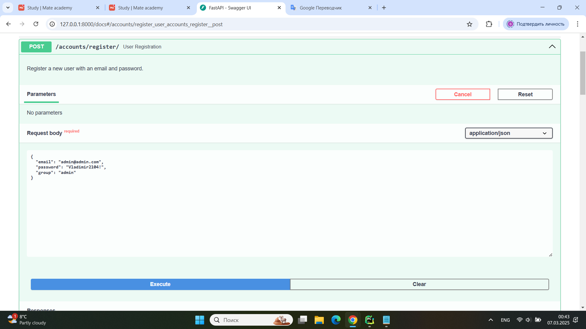
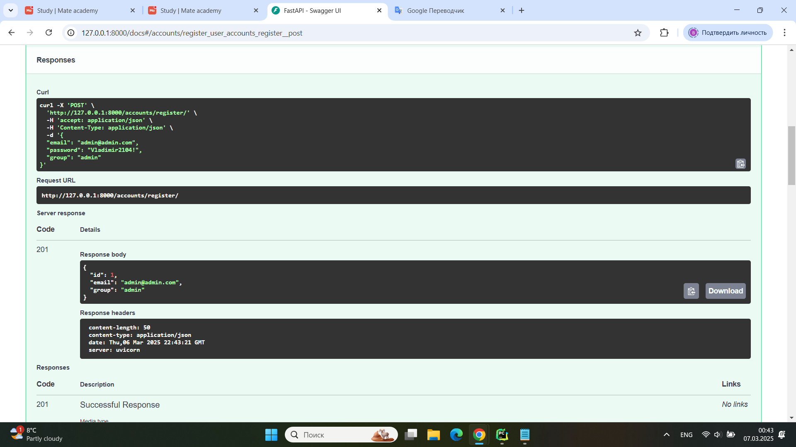
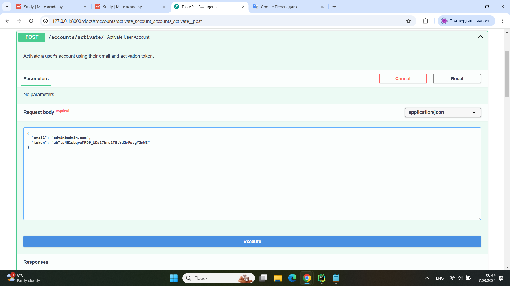
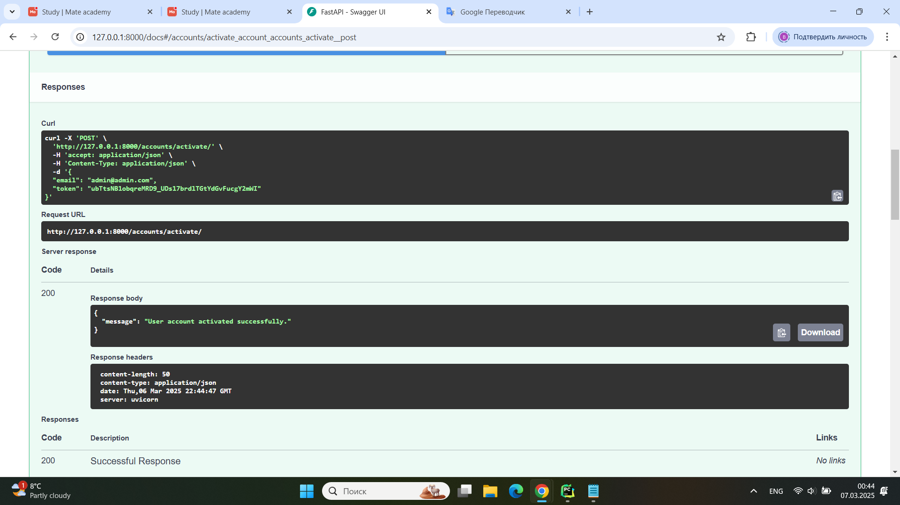
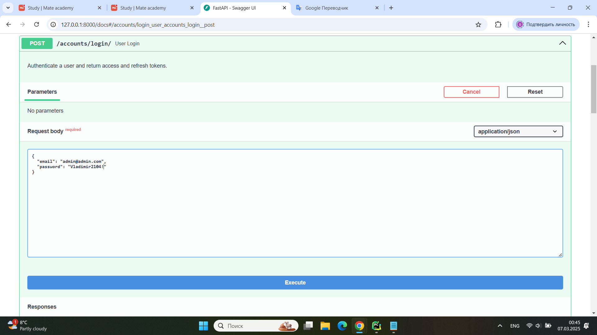
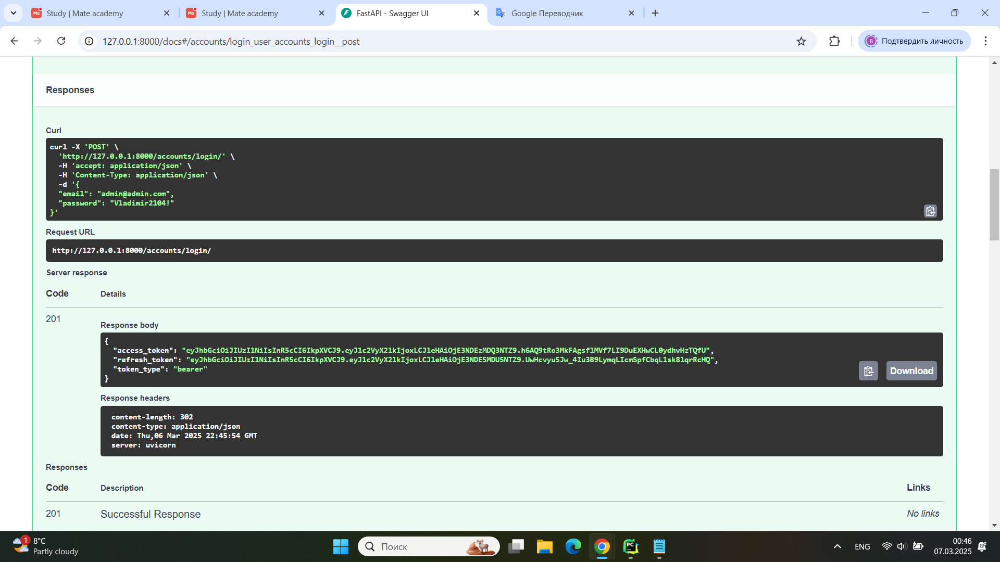
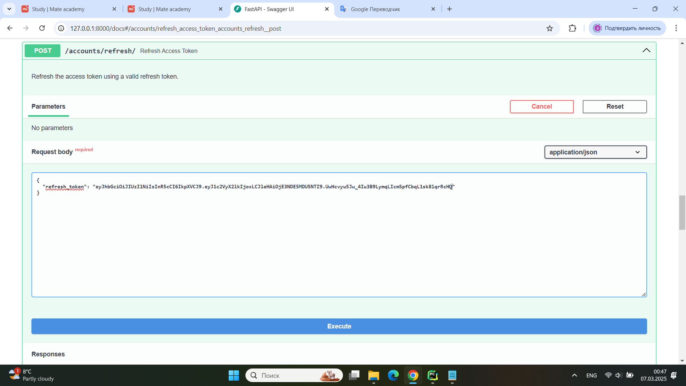
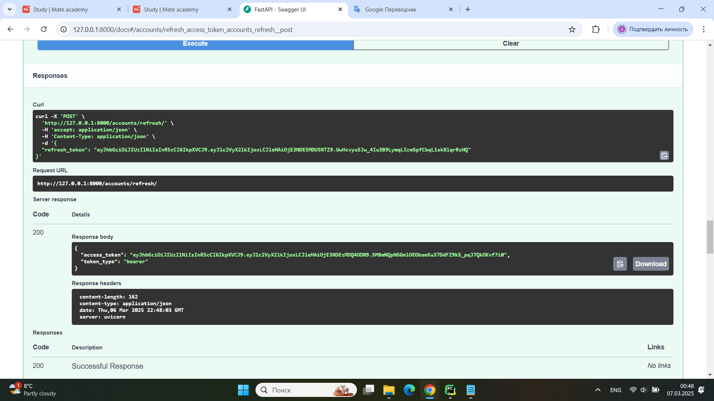
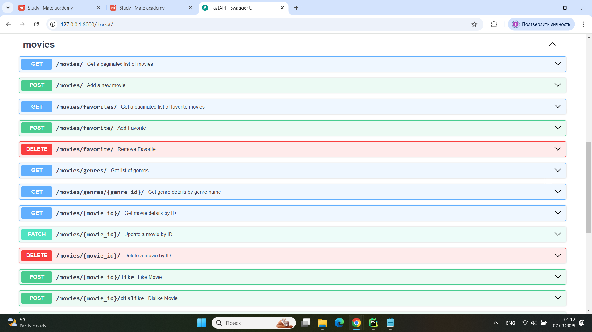

# Library Service

### 👉 Description

Service for cinema management written on FastAPI.  
Project for managing cinema with movies and shopping carts

### 👉 Tasks:
##### 1) Authorization and Authentication

* Registration with an activation email.
* Account activation using the received token.
* Resending the activation token if the previous one expires.
* Use celery-beat to periodically remove expired tokens.
* Login that issues JWT tokens (access and refresh).
* Logout that revokes the refresh token.
* Password reset with a token sent via email.
* Enforce password complexity checks when changing or setting a new password.
* User groups (User, Moderator, Admin) with different sets of permissions.

##### 2) Movies

User Functionality:
* Browse the movie catalog with pagination.
* View detailed descriptions of movies.
* Like or dislike movies.
* Write comments on movies.
* Filter movies by various criteria (e.g., release year, IMDb rating).
* Sort movies by different attributes (e.g., price, release date, popularity).
* Search for movies by title, description, actor, or director.
* Add movies to favorites and perform all catalog functions (search, filter, sort) on the favorites list.
* Remove movies from favorites.
* View a list of genres with the count of movies in each. Clicking on a genre shows all related movies.
* Rate movies on a 10-point scale.
* Notify users when their comments receive replies.

Moderator Functionality:
* Perform CRUD operations on movies, genres, and actors.
* Prevent the deletion of a movie if at least one user has purchased it.

##### 3) Shopping Cart

User Functionality:
* Users can add movies to the cart if they have not been purchased yet.
* If the movie has already been purchased, a notification is displayed,
indicating that repeat purchases are not allowed.
* Users can remove movies from the cart if they decide not to proceed with the purchase.
* Users can view a list of movies in their cart.
* For each movie in the cart, the title, price, genre, and release year are displayed.
* Users can manually clear the cart entirely.

Moderator Functionality:
* Admins can view the contents of users' carts for analysis or troubleshooting.
* Notify moderators when attempting to delete a movie that exists in users' carts.

##### 4) Poetry for Dependency Management
##### 5) Swagger Documentation
##### 6) Tests

### 👉 Installing using GitHub

Python3 must be already installed

### ✨ How to use it

> Download the code 

```bash
$ # Get the code
$ git clone https://github.com/VladimirDolhyi/cinema-fastapi.git
$ cd cinema_fastapi
```

#### 👉 Set Up

> Install modules via `VENV`

```bash
$ python -m venv venv
$ source venv/bin/activate (on macOS)
$ venv\Scripts\activate (on Windows)
```

> Install Dependencies with Poetry

```bash
# Install Poetry if not already installed
$  pip install poetry

# Install project dependencies
$  poetry install
```

> Apply migrations manually

```bash
$ poetry run alembic upgrade head
```

> Run the server

```bash
$ poetry run uvicorn src.main:app --host 0.0.0.0 --port 8000 --reload
```

> Verify Setup      
After all services are running, you can test the API by accessing the **OpenAPI documentation**:

```bash
$ http://localhost:8000/docs
```

### 👉 Getting access -- Authorization and Authentication

#### Register example


#### Activate example


#### Login example


#### Refresh access token example



### 👉 Endpoints Example


### 👉 Features

* JWT authenticated
* Documentation is located at /docs
* Managing movies and shopping carts
